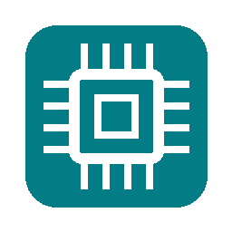

<div align="center">
  
  <h1>SerialForge</h1>
  <p><strong>A modern, cross-platform serial communication utility designed for hardware testing, debugging, and controlling FPGA-based systems.</strong></p>
</div>

---

**SerialForge** provides a clean and intuitive desktop interface allowing developers to easily detect available serial ports, connect to a selected device, send custom commands, and monitor real-time responses through a built-in console log. 

Built with a developer-focused workflow in mind, its modern dark-mode interface improves readability, reduces visual clutter, and makes hardware testing more efficient and professional.

## 🚀 Features

- **Device Auto-Detection:** Easily refresh and discover available COM ports.
- **Configurable Serial Settings:**
  - Baud Rates (9600, 115200, etc.)
  - Data Bits (5, 6, 7, 8)
  - Parity (None, Even, Odd, Mark, Space)
  - Stop Bits (1, 1.5, 2)
- **Real-Time Data Console:** View incoming and outgoing data, with auto-scrolling log boxes.
- **Hex Representation:** Automatically displays sent/received bytes in hex format when appropriate.
- **Quick Controls:** Seamless connect/disconnect, clear logs, and quick-send mechanisms.
- **Cross-Platform:** Built with Qt 6/C++ to work on Windows, macOS, and Linux.

## 🛠 Prerequisites

To build the project from source, you will need:
- **CMake** (v3.16 or higher)
- **Qt 6** (Widgets and SerialPort modules)
- A compatible C++17 compiler (e.g., MSVC on Windows, GCC/Clang on Linux/macOS)

## 🏗 Building from Source

1. Clone the repository:
   ```bash
   git clone https://github.com/brilliantnarlo/serial-forge.git
   cd serial-forge
   ```

2. Configure with CMake:
   ```bash
   cmake -B build -S . -DCMAKE_BUILD_TYPE=Release
   ```

3. Build the project:
   ```bash
   cmake --build build --config Release
   ```

## 📦 Installation (Windows)

A standalone installer can be generated using **Inno Setup**. Once the project is built in `Release` mode and Qt dependencies are deployed via `windeployqt`, you can compile the `installer.iss` file to generate `SerialForge_Setup.exe` in the `installer` directory.

Alternatively, you can just download the latest setup executable from the releases page (if available) and run it!

## 🤝 Usage

1. Open **SerialForge**.
2. Select your device's **COM Port** from the dropdown menu (click the refresh icon if it doesn't appear).
3. Set the appropriate **Baud Rate**, **Data Bits**, **Parity**, and **Stop Bits** to match your hardware.
4. Click the **Connect** icon to establish the serial link.
5. Use the input field at the bottom to send string commands or hex payloads to your device.
6. The terminal box will print real-time communication logs.

## 📄 License

This project is licensed under the **MIT License**. See the [LICENSE](LICENSE) file for more information.
